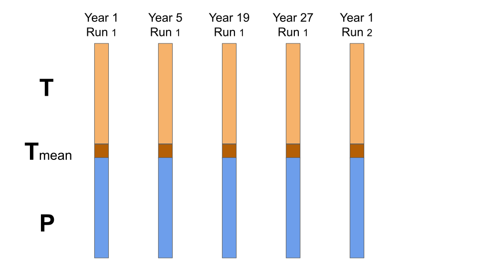

stateVector
===========

This page should introduce concepts needed to build state vectors. It should include

1. State vectors
2. ensembles
3. State vs Ensemble dimensions
4. Sequences
5. Reference indices
6. Sequence indices
7. Mean Indices

----

The ``stateVector`` class is used to design and build state vector ensembles. The class implements ``stateVector`` objects, which act as design templates for state vector ensembles. Users can edit a template to describe an ensemble that matches their requirements. When finished, they can then use the template to automatically build a state vector ensemble that conforms to its design.

The ``stateVector`` class relies on ``.grid`` catalogues to describe climate data in a systematic manner. This allows users to use ``gridfile`` metadata values to design their state vector ensembles. In a typical workflow, users will these metadata values to select the gridfile data that should be used in a state vector.

New Concepts
------------
....write an intro to the next few sections....

State Vectors
-------------

State vectors are a fundamental concept for ensemble-based assimilation methods. In brief, a **state vector** is a collection of climate variables and parameters that describe the state of the climate system over some period of time. These variables are reshaped into a vector of data values, hence a "state vector". Typically, state vectors are constructed from climate model output, so each state vector provides one **potential** description of the climate system (or at least, the part of the system that we're interested in). There is no strict definition for the contents of a state vector, but they often contain one or more climate variables at a set of spatial points. In some cases, a state vector may include a trajectory of several points in time - for example, successive months of the year, or successive years after a volcanic event.

In the context of assimilation, state vectors will generally include two types of variables:

1. Reconstruction targets, and
2. Climate variables required to run proxy forward models

In some cases, a variable can fall into both categories.

Whatever the application, a state vector can include data from a variety of climate variables at different spatial and temporal resolutions. Figure 1 illustrates an example state vector.

.. figure:: images/state-vector.svg
    :alt: A single column runs from the top of the figure to the bottom and is labeled as a state vector. The column has three colored sections. A long, light-orange section runs from the top to the center and is labeled as monthly, gridded temperature. A short, dark-orange section in the center is labeled as annual, global mean temperature. A long, blue section runs from the center to the bottom and is labeled as monthly, gridded precipitation.

    Figure 1: A state vector with temperature, mean temperature, and precipitation variables.

This example state vector includes data derived from two different climate variables (temperature and precipitation), data with different spatial resolutions (global-mean and spatial gridded), and different temporal resolutions (annual and monthly). Most likely, this state vector describes the state of the climate system for some modeled year.

Ensembles
---------

The ``DASH`` toolbox focuses on *ensemble* DA methods, which rely on state vector ensembles. A state vector **ensemble** is a collection of multiple state vectors organized into a matrix. Since each individual state vector represents a possible description of the climate system, an ensemble provides an empirical *distribution* of possible climate states. For paleoclimate applications, the state vectors in an ensemble are typically selected from:

A. Different time steps,
B. Different climate models, and/or
C. Different model runs

and we often refer to the different state vectors in an ensemble as **ensemble members**.

Continuing the previous example, a small ensemble for our state vector might look like:

    Figure 2: An example ensemble (N=5) selected from different time points and/or model runs.

Here, each column is a different state vector (ensemble member). Each ensemble member has data for the temperature, mean temperature, and precipitation variables, but from different time steps. In the case of ensemble member 5, the ensemble member is from the same time step as ensemble member 1, but from a different climate model run.
